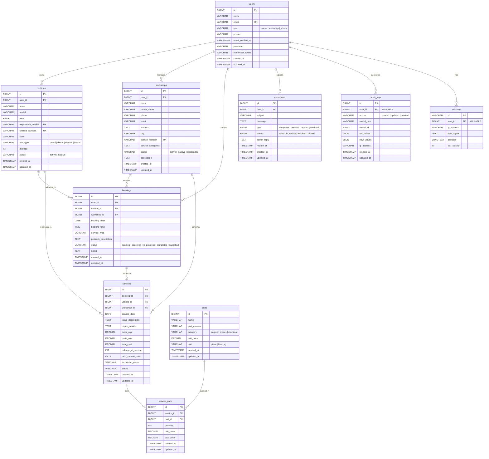

# ER Diagram — Vehicle Service Management System

> This ER Diagram is derived from the Eloquent model relationships and migration foreign keys. The `service_parts` table is a **junction/pivot table** that implements the **many-to-many** relationship between `services` and `parts`.

---

## Entity-Relationship Diagram

---

## Relationship Summary Table

| Relationship | Type | Description |
|---|---|---|
| `users` → `vehicles` | **One-to-Many** | A user (owner) can own many vehicles |
| `users` → `workshops` | **One-to-Many** | A user (workshop role) can manage many workshops |
| `users` → `bookings` | **One-to-Many** | A user can create many bookings |
| `users` → `complaints` | **One-to-Many** | A user can submit many complaints |
| `users` → `audit_logs` | **One-to-Many** | A user can generate many audit log entries |
| `users` → `sessions` | **One-to-Many** | A user can have many active sessions |
| `vehicles` → `bookings` | **One-to-Many** | A vehicle can have many bookings |
| `vehicles` → `services` | **One-to-Many** | A vehicle can have many service records |
| `workshops` → `bookings` | **One-to-Many** | A workshop can receive many bookings |
| `workshops` → `services` | **One-to-Many** | A workshop can perform many services |
| `bookings` → `services` | **One-to-One** | A booking results in at most one service record |
| `services` ↔ `parts` | **Many-to-Many** | A service uses many parts; a part is used in many services (via `service_parts` pivot) |

---

## Cardinality Notation Key

| Symbol | Meaning |
|--------|---------|
| `\|\|` | Exactly one |
| `o\|` | Zero or one |
| `o{` | Zero or many |
| `\|{` | One or many |
